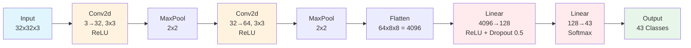

# 🏗️ System Architecture

This document details the architecture of the **Traffic Sign Classifier (CNN + CLIP)** system.

---

## 📊 System Overview

```mermaid
graph TD
    A[GTSRB Dataset<br/>Hugging Face] -->|Load & Split| B(Preprocessing<br/>Resize 32x32<br/>Normalize)
    B -->|Training Data| C[CNN Model<br/>Training]
    B -->|Test Data| D[Evaluation<br/>Accuracy Metrics]
    
    C -->|Save Weights| E[models/best.pth]
    
    F[New Image<br/>Upload] -->|Preprocess| G[CNN Inference<br/>Forward Pass]
    E -->|Load Weights| G
    G -->|Predicted Class| H[Label Decoder<br/>e.g., 'Stop Sign']
    G -->|Confidence| I[Softmax Score]
    
    J[CLIP Model<br/>ViT-B/32] -->|Encode Image| K[Image Embedding]
    J -->|Encode Text| L[Text Embeddings<br/>43 Class Names]
    K -->|Similarity| M[Best Match<br/>Description]
    
    G --> H
    G --> I
    K --> M
    
    H --> N[Gradio UI<br/>Display Results]
    I --> N
    M --> N
    
    style A fill:#e1f5fe
    style C fill:#fff3e0
    style E fill:#e8f5e9
    style J fill:#f3e5f5
    style N fill:#ffebee
```


## 🧠 CNN Architecture Details

Our custom CNN follows a classic Convolutional → Pooling → Fully Connected design:


### Layer Specifications

| Layer   | Type                    | Input    | Output   | Parameters   |
| ------- | ----------------------- | -------- | -------- | ------------ |
| Conv1   | Conv2d + ReLU           | 32x32x3  | 30x30x32 | 896          |
| Pool1   | MaxPool 2x2             | 30x30x32 | 15x15x32 | 0            |
| Conv2   | Conv2d + ReLU           | 15x15x32 | 13x13x64 | 18,496       |
| Pool2   | MaxPool 2x2             | 13x13x64 | 6x6x64   | 0            |
| Flatten | Flatten                 | 6x6x64   | 4096     | 0            |
| FC1     | Linear + ReLU + Dropout | 4096     | 128      | 524,416      |
| FC2     | Linear                  | 128      | 43       | 5,547        |
| Total   |                         |          |          | ~549K params |

## 🔄 Training Pipeline

```
sequenceDiagram
    participant Data as GTSRB Dataset
    participant Prep as Preprocessing
    participant Model as CNN Model
    participant Loss as CrossEntropy
    participant Opt as Adam Optimizer
    
    loop Each Epoch (15 total)
        Data->>Prep: Load batch (32 images)
        Prep->>Model: Normalized tensor (32x32x3)
        Model->>Loss: Forward pass → Logits
        Loss->>Opt: Compute loss & gradients
        Opt->>Model: Update weights
        Model->>Data: Next batch
    end
    
    Model->>Model: Save best.pth
```
### Training Hyperparameters

| Parameter         | Value                       |
| ----------------- | --------------------------- |
| Optimizer         | Adam                        |
| Learning Rate     | 1e-3                        |
| Loss Function     | CrossEntropyLoss            |
| Batch Size        | 32                          |
| Epochs            | 15                          |
| Dropout           | 0.5                         |
| Data Augmentation | 7 types (noise, blur, etc.) |

## 🤖 CLIP Integration Flow

CLIP is used post-hoc for generating human-readable explanations:

```text
graph LR
    Img[Input Image] --> CLIP[CLIP Model<br/>ViT-B/32]
    CLIP --> ImgEmb[Image Embedding<br/>512-dim]
    
    Txt[43 Class Names<br/>e.g., 'Stop Sign'] --> CLIP
    CLIP --> TxtEmb[Text Embeddings<br/>43x512-dim]
    
    ImgEmb --> Sim[Cosine Similarity]
    TxtEmb --> Sim
    Sim --> Best[Best Match<br/>Description]
    
    style Img fill:#e1f5fe
    style CLIP fill:#f3e5f5
    style Best fill:#e8f5e9
```

`Note:` CLIP is NOT used for classification. The CNN performs classification; CLIP only provides interpretability.

## 📦 Deployment Architecture (Gradio)

```
graph TB
    User[User Uploads Image] --> Gradio[Gradio Interface]
    Gradio --> Prep[Preprocessing<br/>Resize, Normalize]
    Prep --> CNN[CNN Inference]
    CNN --> Pred[Predicted Class + Confidence]
    CNN --> CLIP_EX[CLIP Explanation]
    Pred --> Display[Display Results]
    CLIP_EX --> Display
    Display --> User
    
    style User fill:#ffebee
    style Gradio fill:#fff3e0
    style CNN fill:#e1f5fe
    style CLIP_EX fill:#f3e5f5
    style Display fill:#e8f5e9
```

### **🔮 Future Extensions**
- [ ] ONNX Export: Convert PyTorch model to ONNX for edge deployment

- [ ] TensorRT Optimization: For real-time inference on NVIDIA Jetson

- [ ] Multi-task Learning: Add detection + segmentation heads

- [ ] Active Learning: Uncertainty sampling for continuous improvement